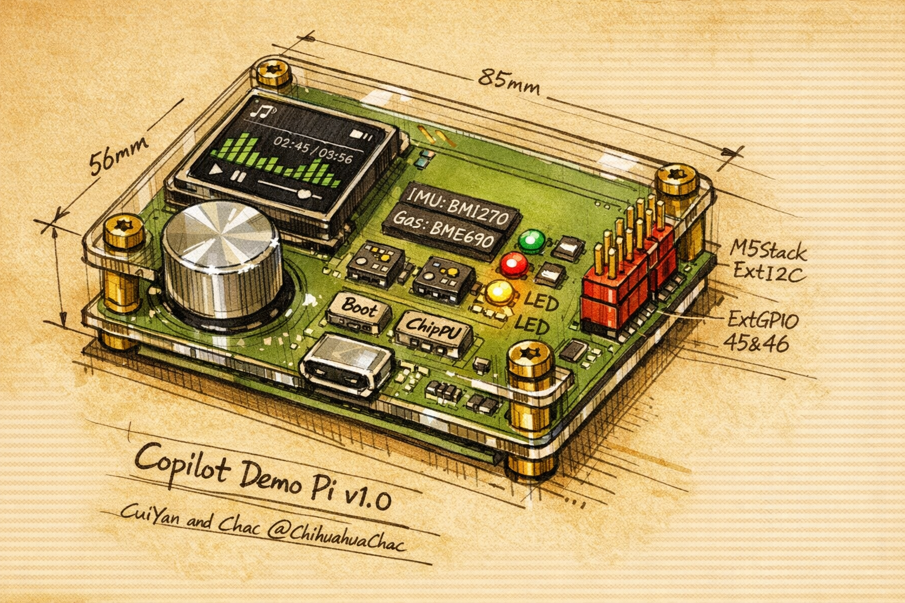

# Start Here



Welcome to **CopilotDemoPi** — a smart Bluetooth speaker with environmental monitoring, built on ESP32-S3 in a Raspberry Pi form factor. This guide will help you get oriented and start contributing.

---

## Repo Layout

```
CopilotDemoPi/
├── democode/           ESP-IDF firmware source code (build this!)
├── Firmware/           Firmware specs, flashing guide, and pre-built binary
│   ├── AGENTS.md       Coding rules for firmware development (read this first!)
│   ├── FLASHING.md     How to flash the pre-built binary
│   └── *.bin           Pre-compiled firmware image
├── Docs/               Design documents and references
│   ├── CopilotDemoPi_hardware_resource.md   Full hardware spec & IO map
│   ├── CopilotDemoPi_BOM.md                 Bill of materials
│   ├── CopilotDemoPi_SDD.md                 Software design document
│   ├── CopilotDemoPi_firmware_plan.md       Firmware development plan
│   ├── CopilotDemoPi_ERC_fix_log.md         ERC debugging record
│   └── ai_hardware_design_journal.md        AI-assisted design story
├── Hardware/           PCB photos, schematics (PDF), and logo assets
├── Start-here/         You are here!
└── README.md           Project overview and technical specs
```

---

## Prerequisites

| Tool | Version | Purpose |
|------|---------|---------|
| [ESP-IDF](https://docs.espressif.com/projects/esp-idf/en/stable/esp32s3/get-started/) | v5.x | Build & flash firmware |
| [KiCad](https://www.kicad.org/) | 8.x+ | View/edit schematics and PCB layout |
| [Git](https://git-scm.com/) | 2.x+ | Version control |
| USB-C cable | — | Flash and debug via USB |

> **Note:** If you only want to review the hardware design, KiCad and a PDF viewer are sufficient — no ESP-IDF needed.

---

## Firmware Quick Start

### 1. Clone the repo

```bash
git clone https://github.com/mscy/ProjectCopilotDemoPi.git
cd ProjectCopilotDemoPi
```

### 2. Set up ESP-IDF

Follow the [official installation guide](https://docs.espressif.com/projects/esp-idf/en/stable/esp32s3/get-started/index.html) for your OS, then activate the environment:

```bash
. $HOME/esp/esp-idf/export.sh
```

### 3. Configure the target

```bash
idf.py set-target esp32s3
```

### 4. Build

```bash
idf.py build
```

### 5. Flash

Connect the board via USB-C, then:

```bash
idf.py -p /dev/ttyUSB0 flash monitor
```

> Replace `/dev/ttyUSB0` with your actual serial port (e.g., `/dev/ttyACM0` on Linux, `/dev/cu.usbmodem*` on macOS, `COM3` on Windows).

For flashing the pre-built binary without building, see [`Firmware/FLASHING.md`](../Firmware/FLASHING.md).

---

## Key Documents

Start with these in order:

1. **[README.md](../README.md)** — Project story, specs, and how AI helped design the hardware
2. **[AGENTS.md](../Firmware/AGENTS.md)** — Firmware coding rules (language, style, drivers, error handling). **Read before writing any code.**
3. **[Hardware Resource Guide](../Docs/CopilotDemoPi_hardware_resource.md)** — Complete IO map, pin assignments, and peripheral details
4. **[Firmware Plan](../Docs/CopilotDemoPi_firmware_plan.md)** — Development roadmap and module breakdown
5. **[BOM](../Docs/CopilotDemoPi_BOM.md)** — Full bill of materials with part numbers

---

## Contribution Guidelines

### Code Style

All firmware code must follow the rules in [`AGENTS.md`](../Firmware/AGENTS.md). Key points:

- **Language:** C (not C++), using ESP-IDF v5.x
- **Naming:** `snake_case` for functions/variables, `UPPER_SNAKE_CASE` for constants
- **Logging:** Use `ESP_LOGI()` / `ESP_LOGW()` / `ESP_LOGE()` — never `printf()`
- **Errors:** Every hardware function returns `esp_err_t`; check every return value
- **Drivers:** Write from scratch using ESP-IDF APIs — no third-party libraries (except LVGL, BSEC2, ESP-ADF)

### Branching & PRs

1. Create a feature branch from `main`
2. Make focused, well-tested commits
3. Open a pull request with a clear description of changes
4. Ensure the build passes (`idf.py build`) before submitting

### Hardware Changes

- Schematic and PCB edits should be made in KiCad
- Export updated PDFs for review
- Document any pin reassignments in the hardware resource guide

---

## FAQ

**Q: Do I need the physical board to contribute?**
A: Yes. This project is a showcase of how to design hardware products together with AI — from chip selection and schematic review to PCB layout and ERC debugging. Having the physical board lets you validate the full design cycle end-to-end.

**Q: Can I use Arduino or PlatformIO?**
A: No. This project uses ESP-IDF exclusively. See [AGENTS.md](../Firmware/AGENTS.md) for details.

**Q: Where are the KiCad project files?**
A: The schematic PDFs are in `Hardware/`. The full KiCad project files (`.kicad_sch`, `.kicad_pcb`) are referenced in the docs but may be in a separate location — check with the maintainers.

**Q: How do I add a new driver?**
A: Follow the structure in `AGENTS.md` § 5 (Project Structure). Place your driver in `main/drivers/`, name it `module.c` / `module.h`, prefix all functions with the module name, and add a self-test function.

**Q: Where can I find the pin assignments?**
A: See the `config.h` section in [AGENTS.md](../Firmware/AGENTS.md) or the full [Hardware Resource Guide](../Docs/CopilotDemoPi_hardware_resource.md).

---

*Ready to build? Start by reading [AGENTS.md](../Firmware/AGENTS.md), then pick a module from the [firmware plan](../Docs/CopilotDemoPi_firmware_plan.md). Happy hacking!*
